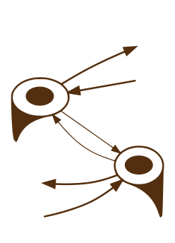

<div align="center">
  
</div>

# PQ-Graph: Module for pdaggerq

pq_graph is an extension of the pdaggerq package, introducing graph-theoretical techniques to optimize many-body equations generated by pdaggerq. pq_graph will automatically generate intermediates and reorder expressions to minimize the number of floating point operations required to evaluate the equations. The module will generate code to evaluate these expressions using either Python with [Numpy](https://numpy.org/) or C++ with [TiledArray](https://valeevgroup.github.io/tiledarray/dox-master/index.html).

The expressions are stored in data structures that represent tensor contractions as [directed graphs](https://en.wikipedia.org/wiki/Quiver_(mathematics)), with tensors represented by vertices. The edges of the graph represent the indices of the tensors, and the contraction of the tensors is represented by the connection of the edge. This representation is analyzed to determine the optimal order of contraction and can generate the graph in a format that can be visualized using [Graphviz](https://graphviz.org/).

## Python API usage

```python
import pdaggerq

# set up pq_graph
graph = pdaggerq.pq_graph({
    "verbose": True,         # print out verbose analysis?    
    "permute_eri": True,     # permute ERI integrals to a common order? (ovov -> vovo; ovvo -> -vovo)
    "allow_merge": True,     # merge similar terms during optimization?    
    "batched": False,        # substitute intermediates in batches for performance? (may yield different equations)
    "batch_size": 100,       # batch size for substitution
    "max_temps": -1,         # maximum number of intermediates to find
    "max_depth": 2,          # maximum depth for chain of contractions
    "max_shape": {           # a map of maximum container size for intermediates
        'o':-1,            
        'v':-1,            
    },                     
    "allow_nesting": True,   # allow nested intermediates?
    "format_sigma": True,    # format equations for a sigma-build? (separates inteermediates w/o sigma vectors)
    "use_trial_index": True, # print an additional index for each trial sigma vector
    "nthreads": -1,          # number of threads to use for optimization (-1 = all)
    "conditions": {          # map of the named conditions for each operator type 
        "t1":  ['t1'],       # terms that have any of these operators will be in an if statement
    }
})

T = ['t1', 't2'] # cluster amplitudes
left_ops = { # projection equations
    "singles_residual": [['e1(i,a)']],     # singles ( 0 = <0| i* a e(-T) H e(T) |0> )
    "doubles_residual": [['e2(i,j,b,a)']]  # doubles ( 0 = <0| i* j* b a e(-T) H e(T) |0> )
}

for eq_name, ops in left_ops.items():
    pq = pdaggerq.pq_helper('fermi')
    pq.set_left_operators(ops)
    pq.add_st_operator(1.0,['f'], T)
    pq.add_st_operator(1.0,['v'], T)
    pq.simplify()

    # queue up the equation for optimization:
    # 1) pass the pq_helper object and the name of the equation.
    # 2) the name is used to label the left-hand side (lhs) of the equation
    # 3) the last argument (optional) overrides the ordering of the lhs indices
    graph.add(pq, eq_name, ['a', 'b', 'i', 'j'])
    pq.clear()

# optimize the equations
graph.reorder()        # reorder contractions for optimal performance (redundant if optimize is called)
graph.optimize()       # reorders contraction and generates intermediates
graph.print("python")  # print the optimized equations for Python.
graph.analysis()       # prints the FLOP scaling (permutations are expanded into repeated terms for analysis)

# create a DOT file for use with Graphviz
graph.write_dot("ccsd.dot") 
```
